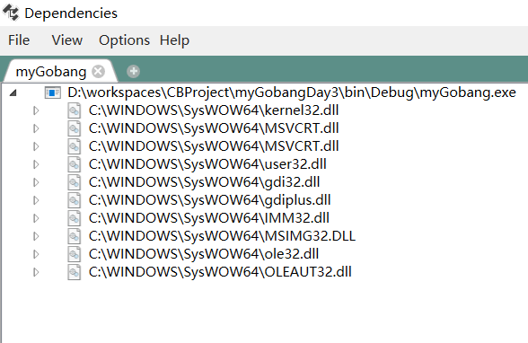

# 第一天


<!--more-->

刚学完C++有点心血来潮，想再挑战一下AI版五子棋的高峰。

## 主要成果

1. 这次采用类继承的方法定义了棋盘和所有成员函数，整体代码比以前用C写的规范很多。

2. 正常输出棋盘，实现双人对局功能。
3. AI方面完成评估函数，完成了对五连、活四、冲四、活三的模型搭建，并且对四种模型赋值。为AI上手做好准备。


## 遇到问题

1. 顶层设计有偏差。这次有两个函数checkSame和sameSum在顶层设计一开始就遗漏了传入参数，在后期修改的时候比较麻烦。这两个函数都需要把row和col作为参数，因为在统计相同棋子数量时，传入的是被评估点的位置坐标，而不是棋盘类中private定义的值。所以所有需要传入其他点坐标的函数，都需要传入参数。

2. 在函数执行顺序方面要留心。

   在我的sumLiveFour函数中有这个语句

   ```c++
   (sameSum(u + 4, row, col) + sameSum(u, row, col)
   ```

   在一开始的时候我将前后两项写反了，所以sameSum返回的distance的值是前面那项（u+4）对应的。导致calculate在计算活四的时候总是不对。所以说在想算法的同时要注意语句的前后顺序。这样的小问题很难察觉。

## 可以改进的地方

1. 添加图形界面
2. 用极大极小值算法+alpha-beta剪枝写出第一代AI

## 源码

https://github.com/zyhhhy/myGobang/tree/master/myGobangDay1


# 第二天

今天主要干了三件事，EGE配置GUI，Dependencies查找dll还有极大极小值算法实现初步AI。

## EGE部分

Codeblocks配置EGE教程。

https://blog.csdn.net/qq_18994119/article/details/80890068

EGE官网绘图教程。

https://xege.org/

EGE五子棋示例。

https://blog.csdn.net/duanghaha/article/details/80835449

本身EGE并不是很难，我最初目的也不是把界面整的花里胡哨的，只是想美化一下界面。此处略过不提。

## Dependencies

我一直在想，我本地编译出来的exe文件，如何在别人的电脑上独立运行。

使用Dependencies神器就可以找到exe调用的动态链接库，打包在一起，进而可以在未装EGE的电脑上独立运行。

使用操作很简单，在软件中选中编译出来的exe文件，得到下图所示。然后从系统库中复制出来需要的dll库，放到与exe同级的文件夹里面。如此在别人未配置环境的电脑上就能独立运行exe文件了。



附Dependencies网盘下载 地址

链接: https://pan.baidu.com/s/1NnAeNeMpycRjdUl6wKxZYg 提取码: cgjb 

## 极大极小值算法和alpha-beta剪枝

原本的想法是这样的：在getScore函数中计算scoreAI和scorePeople，两个值分别代表当前坐标点对于AI方和人类方的评估分数，然后通过scoreAI-scorePeople得出综合优势。这个值越大则越有利于AI局面。

而极大极小值算法就是说AI在思考的时候假设人类会做出最不利于AI的选择，因此AI需要在不利中寻找有利因素。由此建立一棵决策树。


AI是MAX层，在所有下方叶子节点中选择极大值，而人类是MIN层，在所有下方叶子节点中选择极小值。

同时alpha-beta剪枝可以减少运算量。


## 源码

https://github.com/zyhhhy/myGobang/tree/master/myGobangDay2

# 第三天

现在使用极大极小值算法总是出现问题。

一方面getScore函数在中途会修改turn的值，导致下棋的时候会出现开局连续两颗黑子的问题。

还有就是，很多函数接口定义不清楚，比如calculate中包含的各种计算棋型的函数，其核心都是基于checkSame函数的，但是checkSame函数原型为

```c++
return (chess[row][col] == turn);
```

也就是说检查时与turn有关。

我尝试了很多种方法，包括先计算人类的打分值，再计算AI的打分值以此使turn恢复原值。但是好像并没有成功。

再加上CB的debug功能不太会用，所以一直也检查不出什么错误。

后来我想干脆再创建一个virtualChess虚拟棋盘，把原始棋盘的信息往里面一导，所有AI算法都在虚拟棋盘下面进行。可是问题又出现在calculate等函数上面，在写的时候，就没有预留chess这一数据类型的端口，也就是说默认是以chess做计算的，所以即使添加了virtualChess也没有用。

仔细一想，class里的private数据相当于全局变量，这个使用起来既有好处也很危险的。

比如row和col就定义为private变量，主要因为落子方便，但是有时候就比较恶心了。

综上，虽然整个棋盘的成员函数有顶层设计，但是总觉得设计得不够，很明显是经验不足。导致后来经常被作用域坑了。我需要稍微调整一下思路，把能修改接口的部分还是修改一下，不然整个程序可能很难运行了。

## 代码整理

整体是通过row和col来传递计算得到的值进行落子的

针对于turn的说明

**在while循环里turn是不起作用的，所以即使turn被改变，依旧落子为当前颜色**

那么问题来了，为什么在执行过程中，连续下了两个点都是黑子

是不是8，8点覆盖了？

但是应该不是，覆盖时颜色自动覆盖，所以不可能

**checkAround**

getscore得到的值为当前颜色得到的打分值

原则上不用virtualChess肯定不行，但是问题在于所有计算的地方使用的都是chess

那么解决方法来了，**直接把chess改为virtualChess即可，因为这些计算分值的函数都是为AI预备的**

有一个很重要的问题在于

AI知道赢但是不知道堵

发现问题了，**在AI_2_MIN里面，直接调用getScore，那么这时候还没有修改为对方，所以这里的逻辑有误**

看来即使是自己写的代码也要好好检查逻辑顺序问题。

现在AI已经明显升级了，大概也有小学水平了。（以前是幼儿园水平）

## 接下来要做的

一直还没做alpha-beta剪枝，这个可以不影响计算的正确率同时提高速度，值得研究研究。

启发式评估

## 阶段性成果源码

https://github.com/zyhhhy/myGobang/tree/master/myGobangDay3


